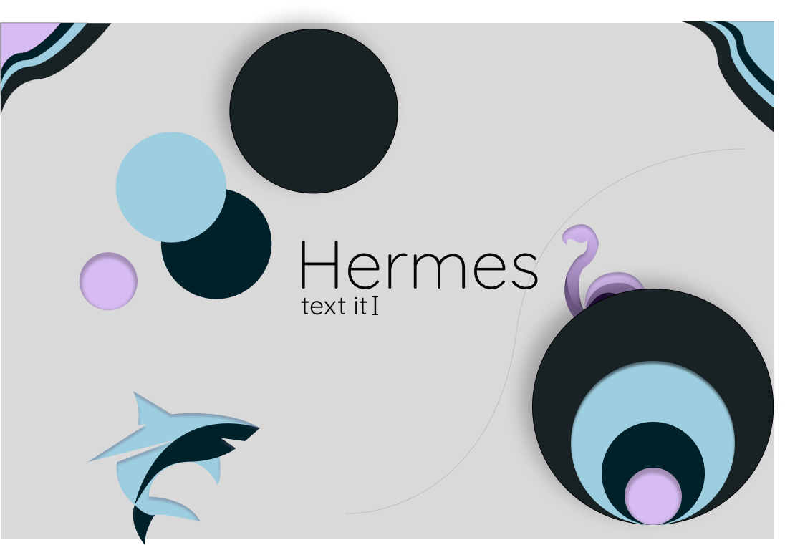

# Hermes Project

We're introducing the **Hermes** text chat, a p2p chat app that aim the main features of market plus the secure communication. Different from most chat apps, **Hermes** is open source and we think decentralized whether by send or by storage.

# Introduction 
TODO: This is an p2p chat app.

# Getting Started
TODO: Guide users through getting your code up and running on their own system. In this section you can talk about:
1.	Installation process
2.	Software dependencies
3.	Latest releases
4.	API references

# Build and Test
TODO: Describe and show how to build your code and run the tests. 
